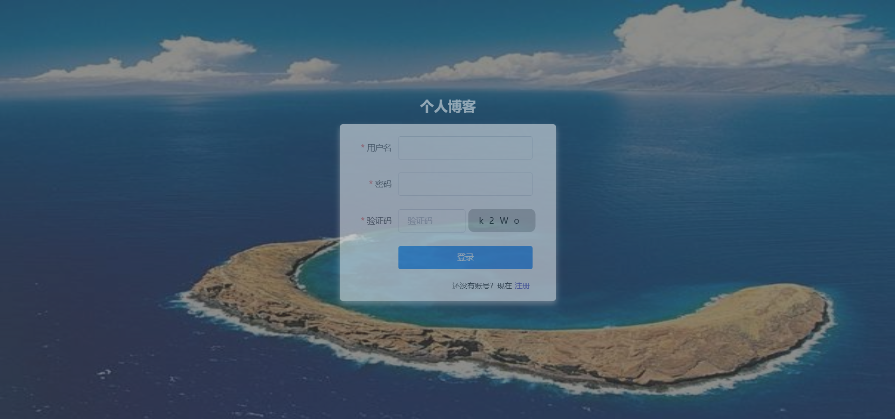
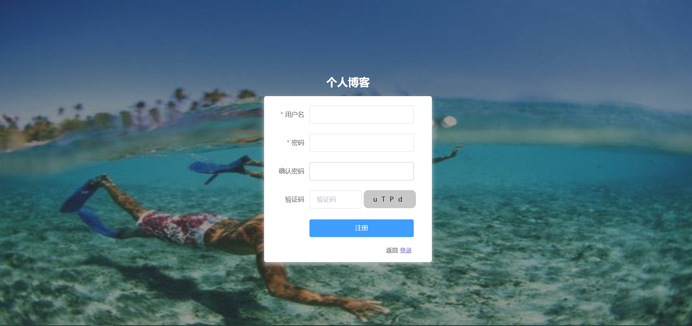
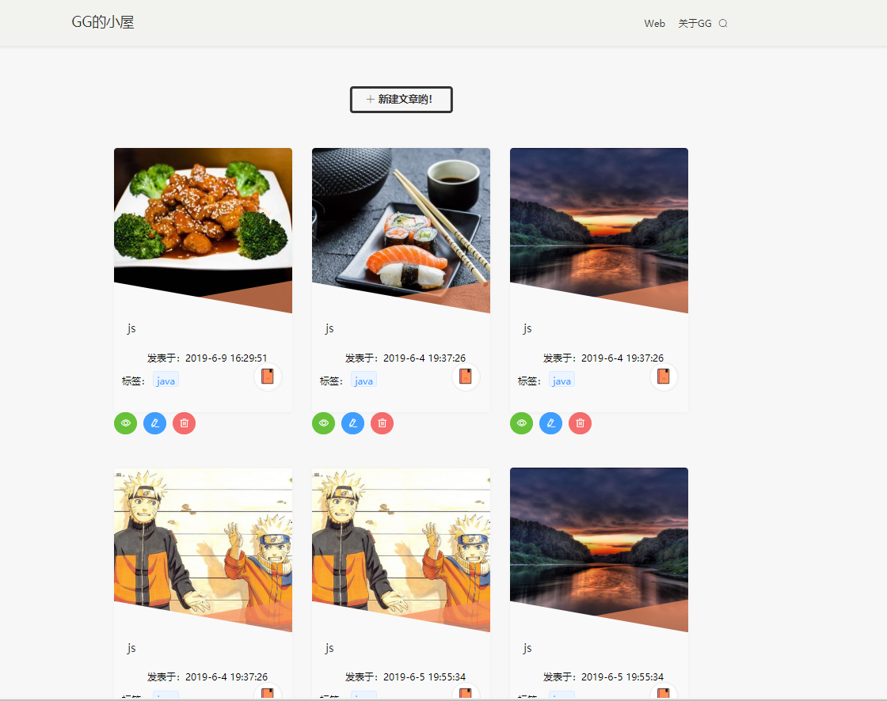
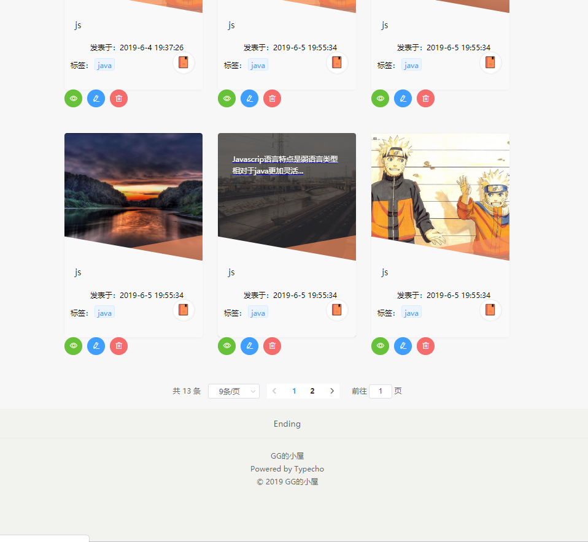
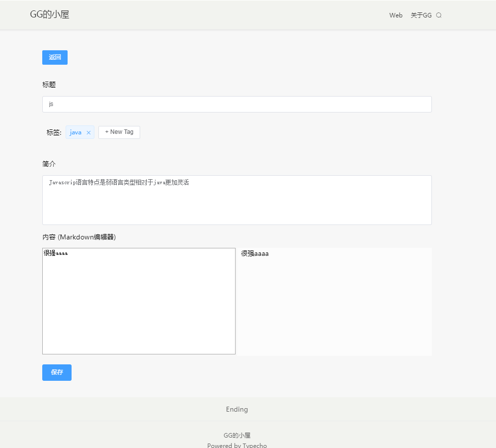

# myblog
个人博客 Vuecli3+element-ui+Node+express+MongoDB

## 操作

~~~
git clone https://github.com/GfromYH/myblog.git

cnpm install

cd client

cnpm install

cd ..

cnpm run dev
~~~

## 功能模块
- 登陆注册以及背景自动切换功能,增加了分页功能

- 个人博客简短查看文章内容***增加删除修改查询搜索***功能

- 支持markdown格式

- 实现了验证码登录，不过验证码背景暂时不知道怎么没渲染上去？w(ﾟДﾟ)w

- 下一步想实现用less预处理器以及webpack压缩我的工程，不过感觉暂时会有点困难=-= o(*≧▽≦)ツ┏━┓
### 校验
- 通过jwt进行token签发，用passport-jwt passport进行token验证
- 采用路由守卫判断token是否失效，失效则跳转login页面

### 功能展示
 + 登录 背景可以自动切换 

+ 注册 背景可以自动切换 

+ 首页index

+ 查询

+ 查看

+ 编辑

+ 新建

+ 删除

+ 404页面

## 未完待续。。。
